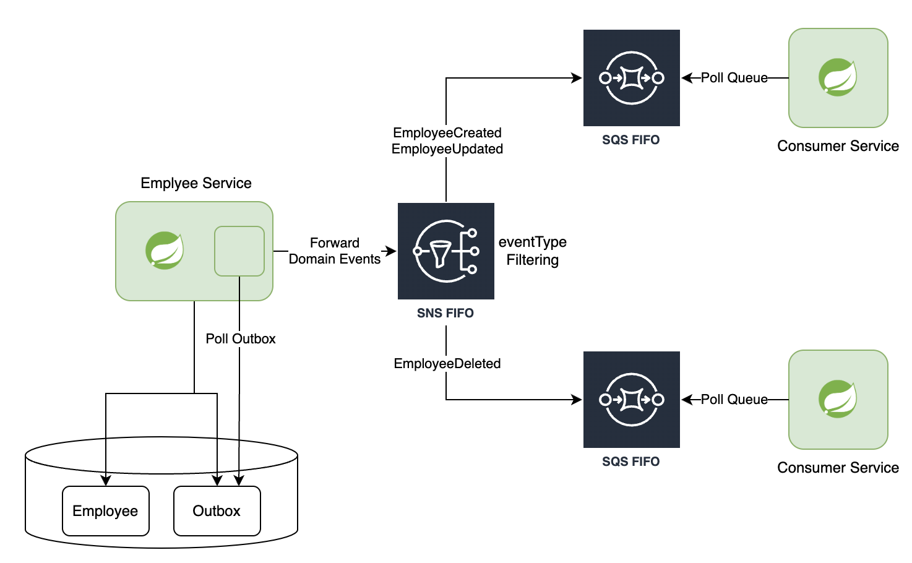

Kotlin Spring JPA를 사용한 transactional outbox pattern 입니다. \
이 프로젝트는 다음 블로그를 참고하여 만들었습니다. [here](https://ioannisioannou.me/transactional-outbox-pattern/)

## Project structure

프로젝트는 아래의 모듈로 구성되어 있습니다.
1) [domain-events](./domain-events). 서로 다른 서비스 간에 공유 되는 도메인 이벤트.
2) [employee-service](./employee-service). transactional outbox pattern을 사용하여 도메인 이벤트를 안정적으로 생성한 다음 이를 SNS FIFO로 전달합니다.
3) [consumer-service](./consumer-service). SQS FIFO를 폴링하여 게시된 도메인 이벤트를 읽습니다. employee-service의 이벤트에 관심이 있는 서비스입니다.

## Architecture

* Employee Service는 Employee 엔티티를 삽입, 업데이트 또는 삭제하고 생성된 도메인 이벤트를 Outbox 테이블에 삽입합니다.
* Amazon SNS 및 Amazon SQS 서비스를 사용하여 여러 소비자에게 안정적으로 이벤트를 전달합니다.
* Employee Service는 Outbox 테이블을 폴링하고 이벤트를 SNS FIFO로 전달합니다.
* 동일한 Employee와 관련된 이벤트가 정렬됩니다. 서로 다른 Employee와 관련된 이벤트가 순서대로 소비될 수 있습니다.
* 이벤트 순서를 유지하기 위해 한 개의 Employee Service 서버만 Database를 읽을 수 있습니다.
* SNS/SQS FIFO는 5분 간격 내에 중복된 메시지 전달이 없도록 보장합니다.
* 각 consumer-service 마다 SQS FIFO가 있습니다.
* SQS FIFO는 Employee SNS FIFO 토픽을 구독합니다. 구독 필터는 특정 이벤트 유형을 구독하는 데 사용됩니다. (eventType)
* Consumer Service는 자체 대기열을 폴링하고 도메인 이벤트를 사용합니다.